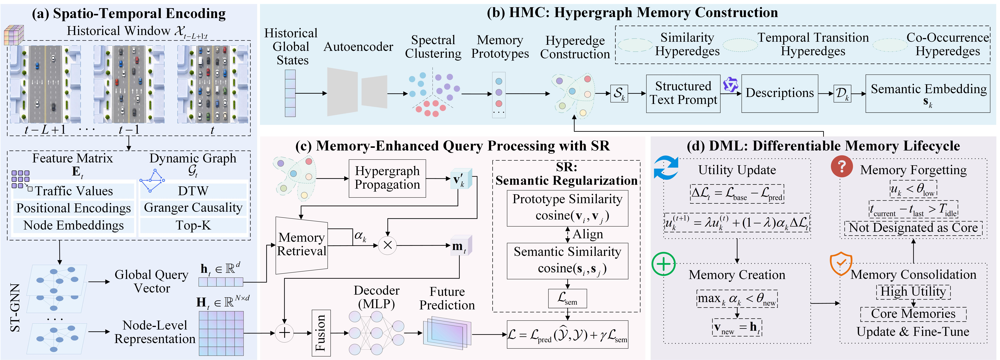

# 🧠 HELMS: Hypergraph Evolving Lifelong Memory System for Traffic Prediction with Semantic Regularization

  

This repository contains the official dataset and code for the paper: **"HELMS: Hypergraph Evolving Lifelong Memory System for Traffic Prediction with Semantic Regularization"**.

## 📝 Overview

HELMS is a hypergraph evolving lifelong memory system designed for traffic prediction. It aims to address several common challenges in urban spatio-temporal traffic data, including concept drift, insufficient utilization of long-term historical patterns, and the lack of semantic explanations for prediction results. Specifically, HELMS first employs a lightweight spatio-temporal encoder to extract traffic state representations and clusters historical spatio-temporal patterns into retrievable memory prototypes. It then constructs a hypergraph memory database to model the similarity, temporal transition, and co-occurrence relationships among different traffic patterns. During prediction, the model retrieves relevant historical patterns from the memory database according to the current traffic state and fuses them with the current spatio-temporal representation to generate future traffic predictions. Meanwhile, HELMS introduces a differentiable memory lifecycle management mechanism to dynamically create, consolidate, and forget memory prototypes, enabling the model to continuously adapt to evolving traffic distributions. In addition, the method leverages large language models to generate semantic labels and aligns memory prototypes with semantic information through semantic regularization, thereby improving the interpretability of prediction results.

<p align="center">
  
  <br>
  <strong>Overall architecture of HELMS.</strong>
</p>

### 💡 Main Innovations

**Hypergraph Semantic Memory Database Construction:** HELMS organizes long-term historical traffic patterns into a hypergraph-structured memory database. Typical spatio-temporal patterns are stored as memory prototypes, while hyperedges are used to characterize the similarity, transition, and co-occurrence relationships among different patterns, enabling more effective exploitation of long-term historical knowledge.

**Differentiable Memory Lifecycle Management:** HELMS designs a dynamic memory management strategy that updates the utility score of each memory according to its contribution to prediction. It automatically performs new pattern insertion, high-value memory consolidation, and obsolete memory forgetting, allowing the model to adapt to traffic distribution changes and concept drift.

**LLM-based Semantic Regularization:** HELMS uses large language models to generate understandable semantic labels for memory prototypes and applies semantic regularization to align the memory space with the semantic space. This enhances model interpretability without introducing additional online inference overhead.

**Memory-enhanced Spatio-temporal Prediction Framework:** HELMS introduces retrievable long-term memory into conventional spatio-temporal graph prediction models. As a result, the model does not rely solely on the current input window, but can also retrieve similar historical traffic patterns, improving prediction stability and long-horizon forecasting capability in complex traffic scenarios.

## 📊 Datasets

Datasets (PeMS04, PeMS08, and PeMS-BAY) are available at [Google Drive](https://drive.google.com/file/d/1G2Ff7ZpxoHAxbcitDH3UXde-H9TH6u57/view?usp=sharing).

## 📁 Project Structure

```plaintext
HELMS/
├── 📄 README.md
├── 🖼️ HELMS.jpg                         # Overall architecture figure
├── 🚀 main.py                           # Main entry for training and evaluation
│
├── ⚙️ configs/                          # Configuration files
│   └── config.yaml                      # Model, memory, training, and dataset settings
│
├── 🗂️ datasets/                         # Data loading and preprocessing code
│   ├── __init__.py
│   ├── data_utils.py                    # Data loading and adjacency construction
│   └── traffic_dataset.py               # Traffic dataset preprocessing
│
├── 🧠 models/                           # Model components
│   ├── __init__.py
│   ├── helms.py                         # Main HELMS model
│   ├── st_gnn.py                        # Spatio-temporal graph encoder
│   ├── hypergraph_memory.py             # Hypergraph memory database
│   ├── dml.py                           # Differentiable memory lifecycle management
│   └── dynamic_graph.py                 # Dynamic graph construction
│
├── 🏋️ train/                            # Training and evaluation pipeline
│   ├── __init__.py
│   └── train_helms.py                   # Training, validation, testing, and result saving
│
├── 🛠️ utils/                            # Utility functions
    ├── __init__.py
    ├── calibration.py                   # Validation-based prediction calibration
    ├── clustering.py                    # Memory prototype clustering
    ├── metrics.py                       # MAE, RMSE, and MAPE
    ├── scaler.py                        # Data normalization
    ├── seed.py                          # Random seed setting
    └── semantic_utils.py                # Semantic embedding and LLM-based annotation
```

## 🚀 Usage

### 📦 Requirements

```plaintext
torch>=1.12.0
numpy>=1.21.0
pandas>=1.3.0
scikit-learn>=1.0.0
PyYAML>=6.0
h5py>=3.6.0
openpyxl>=3.0.0
xlrd>=2.0.0
tqdm>=4.60.0
sentence-transformers>=2.2.0
transformers>=4.37.0
accelerate>=0.26.0
safetensors>=0.4.0
matplotlib>=3.5.0
```

### 🧪 Running Experiments

```plaintext
python main.py --experiment table2 --dataset PEMS04 --root_path /xx/xx/datasets/ --batch_size 16
python main.py --experiment table2 --dataset PEMS08 --root_path /xx/xx/datasets/ --batch_size 16
python main.py --experiment table3 --dataset PEMS-BAY --root_path /xx/xx/datasets/ --batch_size 16
```
