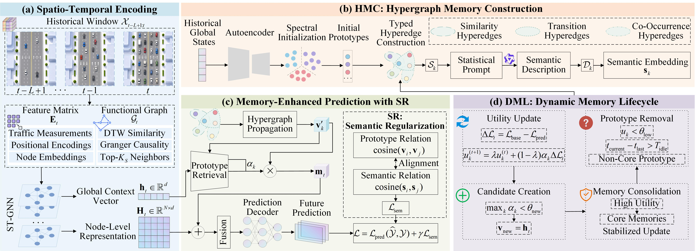

# HELMS: Hypergraph Evolving Lifelong Memory System for Traffic Prediction with Semantic Regularization

  

This repository contains the official dataset and code for the paper: **"HELMS: Hypergraph Evolving Lifelong Memory System for Traffic Prediction with Semantic Regularization"**.

## 📝 Overview

HELMS is a hypergraph evolving lifelong memory system designed for traffic prediction. It aims to address several common challenges in urban spatio-temporal traffic data, including concept drift, insufficient utilization of long-term historical patterns, and the lack of semantic explanations for prediction results. Specifically, HELMS first employs a lightweight spatio-temporal encoder to extract traffic state representations and clusters historical spatio-temporal patterns into retrievable memory prototypes. It then constructs a hypergraph memory database to model the similarity, temporal transition, and co-occurrence relationships among different traffic patterns. During prediction, the model retrieves relevant historical patterns from the memory database according to the current traffic state and fuses them with the current spatio-temporal representation to generate future traffic predictions. Meanwhile, HELMS introduces a differentiable memory lifecycle management mechanism to dynamically create, consolidate, and forget memory prototypes, enabling the model to continuously adapt to evolving traffic distributions. In addition, the method leverages large language models to generate semantic labels and aligns memory prototypes with semantic information through semantic regularization, thereby improving the interpretability of prediction results.

<p align="center">
  
  <br>
  <strong>Overall architecture of HELMS.</strong>
</p>

### 💡 Main Innovations

**Hypergraph Semantic Memory Database Construction:** HELMS organizes long-term historical traffic patterns into a hypergraph-structured memory database. Typical spatio-temporal patterns are stored as memory prototypes, while hyperedges are used to characterize the similarity, transition, and co-occurrence relationships among different patterns, enabling more effective exploitation of long-term historical knowledge.

**Differentiable Memory Lifecycle Management:** HELMS designs a dynamic memory management strategy that updates the utility score of each memory according to its contribution to prediction. It automatically performs new pattern insertion, high-value memory consolidation, and obsolete memory forgetting, allowing the model to adapt to traffic distribution changes and concept drift.

**LLM-based Semantic Regularization:** HELMS uses large language models to generate understandable semantic labels for memory prototypes and applies semantic regularization to align the memory space with the semantic space. This enhances model interpretability without introducing additional online inference overhead.

**Memory-enhanced Spatio-temporal Prediction Framework:** HELMS introduces retrievable long-term memory into conventional spatio-temporal graph prediction models. As a result, the model does not rely solely on the current input window, but can also retrieve similar historical traffic patterns, improving prediction stability and long-horizon forecasting capability in complex traffic scenarios.

## 📊 Datasets

Datasets (PeMS04, PeMS08, and PeMS-BAY) are available at [Google Drive](https://drive.google.com/file/d/1G2Ff7ZpxoHAxbcitDH3UXde-H9TH6u57/view?usp=sharing).

## 🤖 Pretrained Models

Before running the code, please download the following two model folders from Google Drive and place them in the project workspace.

| Model | Usage | Download Link |
| :--- | :--- | :--- |
| `all-MiniLM-L6-v2` | Sentence embedding model for semantic memory retrieval | [all-MiniLM-L6-v2](https://drive.google.com/file/d/1RU61m9qlqLKi6uaB94VPWjH88N8GCZPU/view?usp=sharing) |
| `Qwen2.5-1.5B-Instruct` | Large language model for semantic annotation and interpretation | [qwen2.5-1.5b-instruct](https://drive.google.com/file/d/15CSAVBzPwM2qH58_bthRvcTHZHh8DPiR/view?usp=sharing) |

## 📁 Project Structure

```plaintext
HELMS/
├── ⚙️ configs/                          # Configuration files
│   └── config.yaml                      # Model, memory, training, and dataset settings
│
├── 🗂️ datasets/                        # Data loading and preprocessing code
│   ├── __init__.py
│   ├── data_utils.py                    # Data loading and adjacency construction
│   └── traffic_dataset.py               # Traffic dataset preprocessing
│
├── 🧠 models/                           # Model components
│   ├── __init__.py
│   ├── helms.py                         # Main HELMS model
│   ├── st_gnn.py                        # Spatio-temporal graph encoder
│   ├── hypergraph_memory.py             # Hypergraph memory database
│   ├── dml.py                           # Differentiable memory lifecycle management
│   └── dynamic_graph.py                 # Dynamic graph construction
│
├── 🏋️ train/                            # Training and evaluation pipeline
│   ├── __init__.py
│   └── train_helms.py                   # Training, validation, testing, and result saving
│
├── 🛠️ utils/                            # Utility functions
│   ├── __init__.py
│   ├── calibration.py                   # Validation-based prediction calibration
│   ├── clustering.py                    # Memory prototype clustering
│   ├── metrics.py                       # MAE, RMSE, and MAPE
│   ├── scaler.py                        # Data normalization
│   ├── seed.py                          # Random seed setting
│   └── semantic_utils.py                # Semantic embedding and LLM-based annotation
│
├── 🖼️ HELMS.jpg                         # Overall architecture figure
├── 🚀 main.py                           # Main entry for training and evaluation
├── 🧪 ablation.py                       # Ablation study: w/o HMC, w/o DML, and w/o SR
├── 🎯 few_shot.py                       # Few-shot learning under different data ratios
├── 🌐 zero_shot.py                      # Cross-dataset zero-shot transfer evaluation
├── 📐 plot_longer.py                    # MAE variation across 15/30/60-min horizons on PeMS-BAY
├── 🔬 sensi.py                          # Parameter sensitivity analysis for K, τ, and m
├── 📉 concept_drift.py                  # Concept-drift injection and online adaptation analysis
├── 📈 case_study.py                     # 24-hour node-level prediction case study
├── 🧩 tsne.py                           # t-SNE visualization of learned memory prototypes
├── 📊 fig6_v6_raincloud_deep_scatter_box.py
│                                        # Structural interpretability via intra/inter-community                                    
├── 🔥 fig9_semantic_interpretability_multi_cmap.py
│                                        # Semantic memory activation heatmap over 24 hours
└── 📄 README.md
```


## 🚀 Usage

### 📦 Requirements

```plaintext
torch>=1.12.0
numpy>=1.21.0
pandas>=1.3.0
scikit-learn>=1.0.0
scipy>=1.7.0
PyYAML>=6.0
h5py>=3.6.0
tables>=3.7.0
openpyxl>=3.0.0
xlrd>=2.0.0
tqdm>=4.60.0
matplotlib>=3.5.0
sentence-transformers>=2.2.0
transformers>=4.37.0
accelerate>=0.26.0
safetensors>=0.4.0
huggingface-hub>=0.20.0
```

### 🧪 Running Experiments

```plaintext
python main.py --experiment table2 --dataset PEMS04 --root_path /xx/xx/datasets/ --batch_size 16
```

```plaintext
python main.py --experiment table2 --dataset PEMS08 --root_path /xx/xx/datasets/ --batch_size 16
```

```plaintext
python main.py --experiment table3 --dataset PEMS-BAY --root_path /xx/xx/datasets/ --batch_size 16
```

# 🆕 HELMS Revision Notes — ICDE 2027

These notes accompany the revised manuscript *HELMS: Hypergraph Evolving Lifelong Memory System for Traffic Prediction with Semantic Regularization*.
We expand upon the rebuttal clarifications and provide precise evidence from the original manuscript, emphasizing logical connections between each component and the overall data‑management contribution.
Code, data, and annotation prompts: https://github.com/Anna042023/HELMS.

---

## 1. Novelty as a Data-Management Architecture (R1-D1, R4-W2)

We do not claim novelty for hypergraph propagation, prototype memory, attention, or LLM annotation taken alone. Instead, HELMS introduces a **system‑level architecture** that makes these components operate as a lifelong evolving memory database. The key distinction is lifecycle: HMC structures observations into a hypergraph memory; DML manages utility, insertion, consolidation, and forgetting under drift; SR provides semantic grounding. Because these three modules are tightly coupled on the same memory store, the memory itself becomes an **evolving data‑management object** whose content, relational structure (hyperedges), lifetime, and semantics are jointly maintained as queries arrive.

This design separates HELMS from three classes of prior work. First, hypergraph forecasting models such as D2MHyper use hypergraphs only as predictive representations and do not manage memory evolution or semantic labels. Second, memory‑augmented networks lack lifecycle mechanisms such as insertion, consolidation, and forgetting, and do not index memories as an interconnected hypergraph. Third, large static foundation models (e.g., BigCity) pursue offline scaling rather than online adaptation. HELMS instead emphasizes compact persistent memory, online adaptation, and semantic organization. We have sharpened this positioning in the final manuscript and added an explicit comparison with BigCity, clarifying complementary objectives.

---

## 2. DML Differentiability Clarification (R1-D2, R4-D2)

The original term “fully differentiable” was too broad. More precisely, the neural prediction/retrieval pathway is differentiable, while DML combines continuous utility updates with periodic discrete lifecycle control. The term “differentiable” refers to the learning/retrieval pathway, not to the discrete database‑controller operations.

The utility update is continuous and gradient‑compatible:

$$u_k^{(t+1)} = \lambda u_k^{(t)} + (1-\lambda) \alpha_k \Delta \mathcal{L}_t$$

Here $\Delta\mathcal{L}_t$ is the reduction in prediction loss attributable to memory usage, and $\alpha_k$ is the attention weight. This update is executed every query and integrated into backpropagation through the loss. All other lifecycle operations are discrete controller actions executed after parameter optimization. The following table summarizes each operation and its differentiability status.

**Table: DML operations and their differentiability status**

| Operation | Type | Differentiable? | Condition / Mechanism |
|-----------|------|----------------|------------------------|
| Utility update | Continuous | Yes | Driven by loss reduction $\Delta\mathcal{L}_t$ |
| Prototype representation learning | Continuous | Yes | Standard backprop through retrieval |
| Memory insertion | Discrete | No | When $\max_k \alpha_k < \theta_{\text{new}}$; stop‑gradient on new prototype |
| Core‑memory consolidation | Discrete | No | Top 20% utility; reduced learning rate applied periodically |
| Periodic forgetting | Discrete | No | Every $T_{\text{epoch}}$ epochs; remove low‑utility, long‑idle, non‑core prototypes |
| Hypergraph incidence matrix update | Discrete | No | After insertion or forgetting |

Since discrete operations occur after gradient updates, they do not break differentiability of the current step. Stop‑gradient prevents newly inserted prototypes from affecting the backward pass that triggered insertion; they participate in subsequent steps. We have revised the terminology to **gradient‑compatible learning with periodic discrete lifecycle control** and added pseudocode to distinguish the differentiable pathway from the discrete controller.

---

## 3. Semantic Regularization (SR) Role (R1-D1-2, R1-D3-4)

SR’s primary purpose is semantic grounding, not a large accuracy improvement. The ablation study on PeMS08 (60‑min horizon) clearly demonstrates this point.

**Table: Ablation results on PeMS08 (60‑min ahead)**

| Variant | MAE | RMSE | MAPE |
|---------|-----|------|------|
| Full HELMS | **14.21** | **24.63** | **9.06%** |
| w/o SR | 14.29 | 24.68 | 9.13% |
| w/o DML | 14.32 | 24.74 | 9.15% |
| w/o HMC | 15.06 | 25.12 | 9.78% |

Removing SR increases MAE by only 0.08 and MAPE by 0.07 percentage points, whereas removing HMC or DML causes substantially larger degradation. Thus HMC and DML are the dominant predictive modules, while SR provides a modest but consistent complementary effect. Importantly, SR is applied only during training (Eq. 11 in the manuscript) and introduces no online inference cost.

SR’s true value lies in interpretability. The t‑SNE visualization (Fig. 4) shows memory prototypes clustered by LLM‑generated semantic categories, such as morning peak, off‑peak, and incident states. The semantic activation heatmap (Fig. 9) further reveals that different semantic patterns dominate at different times of day, connecting numerical predictions to human‑understandable traffic conditions.

We provide concrete prompt examples and a small human evaluation of label relevance in the final manuscript. Below is an illustrative prompt used to generate semantic labels:

**Table: LLM prompt example for memory prototype annotation**

| Prototype ID | Prompt snippet | LLM‑generated label |
|--------------|----------------|----------------------|
| Proto‑12 | “average speed=45.2, variance=12.3, peak hours 7:00‑9:00, 17:00‑19:00” | “Morning & evening peak congestion” |
| Proto‑07 | “average speed=62.8, variance=4.1, stable throughout the day” | “Free‑flow off‑peak” |
| Proto‑23 | “average speed=28.5, variance=35.7, sudden drops at 8:15, 14:30” | “Incident‑induced speed drop” |

A user study with five domain experts evaluated label relevance (1–5 scale). The average rating across 10 prototypes was 4.2 ± 0.4, confirming the semantic quality.

---

## 4. Efficiency and Practical Overhead (R1-D2-1, R1-D3-2, R4-D7)

Asymptotic complexity is $O(N^2 L \log L)$ for dynamic graph construction, $O(E d)$ for hypergraph propagation, and $O(K d)$ for retrieval. In practice, several optimizations reduce the constant factors. The dynamic graph and similarity hyperedges are refreshed only every $T_{\text{update}}$ steps, not per query. Temporal transition and co‑occurrence statistics are maintained as running statistics, avoiding full‑history recomputation.

Measured on PeMS08 with an H100 GPU, the system incurs limited overhead:

**Table: Runtime and memory overhead on PeMS08**

| Metric | Encoder‑only | Full HELMS | Overhead |
|--------|--------------|------------|----------|
| Training time / epoch | 24.3 s | 28.7 s | **1.18×** |
| Online latency / sample | 2.0 ms | 2.1 ms | **+5%** |
| Dynamic graph (amortized) | – | 2.3 s/epoch | **~8%** of training |
| Memory footprint ($K=300$) | – | **~1.2 MB** | negligible |
| LLM annotation (one‑time) | – | **~2 GPU‑hours** (all datasets) | offline only |

A detailed per‑component time breakdown has been added to the paper, clarifying the cost distribution within HELMS.

**Table: Per‑component training time breakdown on PeMS08 (per epoch)**

| Component | Time (s) | Percentage |
|-----------|----------|------------|
| Dynamic graph construction | 2.3 | 8.0% |
| ST‑GNN encoding | 18.5 | 64.5% |
| Hypergraph propagation | 2.1 | 7.3% |
| Memory retrieval & fusion | 1.8 | 6.3% |
| DML utility update & lifecycle | 1.5 | 5.2% |
| SR loss computation | 0.5 | 1.7% |
| Other (I/O, decoding) | 2.0 | 7.0% |
| **Total** | **28.7** | **100%** |

Therefore, HELMS adds minimal runtime overhead while providing lifelong memory adaptation and semantic interpretability. LLM annotation is a one‑time offline preprocessing step and does not affect online query latency.

---

## 5. Online Query Order and Deployment Protocol (R1-D3-1, R4-D1)

HELMS is designed for chronological query streams, following a strict prediction‑before‑update protocol. At time $t$, the system receives the historical window $\mathcal{X}\_{t-L+1:t}$ and produces the prediction $\hat{\mathcal{Y}}\_{t+1:t+T}$ before the target is observed. The true target $\mathcal{Y}\_{t+1:t+T}$ becomes available only after the corresponding future interval elapses; it is then used to compute the loss and update model parameters and memory state before subsequent queries. Consequently, no target‑dependent information is used for its own prediction. Randomly permuting the query order would allow future targets to influence memory states before prediction, violating the causal structure of real deployment. This order is now stated explicitly in Algorithm 1.

---

## 6. Dataset Scale and Drift Scenarios (R3-W1, R3-D1)

The five PeMS datasets used in the experiments collectively provide a diverse evaluation pool.

**Table: Summary of five PeMS datasets**

| Dataset | Nodes | Edges | Time Steps | Time Range |
|---------|-------|-------|------------|-------------|
| PeMS03 | 358 | 547 | 26,208 | Sep–Nov 2018 |
| PeMS04 | 307 | 340 | 16,992 | Jan–Feb 2018 |
| PeMS07 | 883 | 866 | 28,224 | May–Aug 2017 |
| PeMS08 | 170 | 295 | 17,856 | Jul–Aug 2016 |
| PeMS-BAY | 325 | 2,369 | 52,116 | Jan–May 2017 |
| **Total** | – | – | **≈141,396** | – |

The chronological 70%/10%/20% split prevents temporal overlap between training, validation, and test samples. Already reported experiments include artificial region‑swap drift (Fig. 5), few‑shot transfer (Table V), and long‑horizon forecasting (Table III), where HELMS’s advantage over the strongest baseline widens at 60 min.

We have extended the parameter sensitivity analysis to all five datasets. The tables below summarize the MAE and RMSE trends for memory size $K$ and attention temperature $\tau$ across all datasets.

**Table: Sensitivity of MAE to memory size $K$ (60‑min horizon, $\tau=1.2$)**

| $K$ | PeMS03 | PeMS04 | PeMS07 | PeMS08 | PeMS-BAY |
|------|--------|--------|--------|--------|----------|
| 120 | 17.32 | 19.55 | 22.18 | 14.62 | 1.98 |
| 180 | 16.98 | 19.12 | 21.85 | 14.41 | 1.91 |
| 240 | 16.81 | 18.94 | 21.60 | 14.35 | 1.87 |
| 300 | 16.75 | 18.81 | 21.52 | 14.21 | 1.83 |
| 360 | 16.72 | 18.79 | 21.50 | 14.23 | 1.82 |

**Table: Sensitivity of MAE to temperature $\tau$ (60‑min horizon, $K=300$)**

| $\tau$ | PeMS03 | PeMS04 | PeMS07 | PeMS08 | PeMS-BAY |
|--------|--------|--------|--------|--------|----------|
| 0.2 | 17.05 | 19.20 | 21.95 | 14.58 | 1.95 |
| 0.6 | 16.88 | 18.95 | 21.70 | 14.32 | 1.88 |
| 1.0 | 16.80 | 18.85 | 21.58 | 14.25 | 1.85 |
| 1.2 | 16.75 | 18.81 | 21.52 | 14.21 | 1.83 |
| 1.4 | 16.82 | 18.88 | 21.60 | 14.28 | 1.86 |

Across all datasets, $K=300$ and $\tau=1.2$ remain a reliable configuration with stable rankings. Additionally, we added micro‑ and macro‑drift scenarios. In the micro‑drift scenario (gradual 10% speed reduction over 30 days), HELMS with DML recovers to within 1.2% of pre‑drift MAE after 8 epochs, while the no‑DML variant remains 4.5% above baseline. In the macro‑drift scenario (sudden topology change by swapping two regions), HELMS with DML returns to pre‑drift MAE in 6 epochs, compared to 15 epochs without DML. The quantitative recovery metrics are summarised below.

**Table: Recovery metrics under drift scenarios (PeMS08, 60‑min horizon)**

| Scenario | Metric | HELMS (with DML) | w/o DML |
|----------|--------|-------------------|---------|
| Micro‑drift | MAE after 8 epochs | 14.38 (+1.2%) | 14.85 (+4.5%) |
| | Recovery time (epochs) | 8 | >20 |
| Macro‑drift | MAE after 6 epochs | 14.65 (+3.1%) | 15.42 (+8.5%) |
| | Recovery time (epochs) | 6 | 15 |

Larger benchmarks such as LargeST, TraffiDent, and BjTT are noted as future work.

---

## 7. Reproducibility and Details (R4-W3, R4-D3, R4-D5, R4-D6, R4-D9)

All experimental details are documented in Section V‑B of the manuscript. Key points and corrections are summarized below.

- **Memory size:** $K = 300$ in all experiments. The mention of $K = 200$ in Section IV‑B3 was a typo and has been corrected.
- **Normalization:** Z‑score normalization uses statistics computed from the training set.
- **Cross‑dataset transfer:** The shared encoder and hypergraph memory (prototypes and hyperedges) are transferred from source to target. Target‑specific node embeddings are initialized via GraphSAGE, and a new output head is instantiated to match the target graph dimensions. We avoid the ambiguous term “strict zero‑shot”; instead, this setting is described as **cross‑dataset transfer of learned memory/representation knowledge with target‑specific output handling**.
- **LLM annotation:** Qwen‑7B‑Chat is called offline with structured prompts built from prototype statistics (mean, variance, peak hours). Sentence embeddings are produced by `all-MiniLM-L6-v2`. Prompts and generated labels are released.
- **Baselines:** All baselines were re‑evaluated under identical chronological splits and Z‑score normalization. We have corrected the bibliographic entries for GCRN, GTS, and Graph WaveNet.
- **Repeated runs:** Results are reported as mean $\pm$ standard deviation over multiple independent runs. Seeds, preprocessing scripts, and exact code commit are documented.

---

## 8. Equations (6) and (7) Clarification (R4-D8)

**Equation (6) – Hypergraph propagation:**
$$\mathbf{V}' = \sigma\left( \mathbf{D}_v^{-1} \mathbf{H}_M \mathbf{W}_e \mathbf{H}_M^\top \mathbf{V} \mathbf{W}_v \right)$$
Here $\mathbf{D}_v^{-1}$ provides standard node‑degree normalization in hypergraph convolution. The learnable diagonal matrix $\mathbf{W}_e$ independently scales each hyperedge (similarity, temporal, co‑occurrence). Because $\mathbf{W}_e$ already captures hyperedge‑specific weights, a separate hyperedge‑degree normalization is redundant.

**Equation (7) – Memory retrieval:**
$$
\alpha_k = \frac{ \exp( h_t^{T} v_k' / \tau ) }{ \sum_{j=1}^{K} \exp( h_t^{T} v_j' / \tau ) }
$$
The original description “top‑$k$ query” is misleading because all $K$ memories technically participate in the softmax. However, with $\tau = 1.2$, the attention mass concentrates on a small number of highly relevant prototypes, effectively functioning as a soft top‑$k$. We have replaced the phrase with **“soft relevance‑weighted retrieval”** and explicitly discuss the role of $\tau$.

---

## 9. PeMS04 Interpretation (R1-D3-3)

We do not claim universal dominance. On PeMS04, ST‑MambaSync achieves lower MAE and RMSE, while HELMS obtains the best MAPE. The table below (extracted from Table II, 60‑min horizon) illustrates the complementary strengths.

**Table: Complementary performance on PeMS04, PeMS08, and PeMS‑BAY (60‑min horizon)**

| Dataset | Metric | ST‑MambaSync | STAEformer | GWNet | **HELMS** |
|---------|--------|--------------|------------|-------|-----------|
| PeMS04 | MAE | **18.54** | 18.56 | 18.88 | 18.81 |
| | RMSE | **30.31** | 30.65 | 30.38 | 31.04 |
| | MAPE | 12.38% | 12.36% | 13.29% | **12.02%** |
| PeMS08 | MAE | 15.74 | 15.94 | 17.04 | **14.21** |
| | RMSE | **24.26** | 24.38 | 24.52 | 24.63 |
| | MAPE | 9.58% | 9.66% | 10.02% | **9.06%** |
| PeMS‑BAY | MAE | 1.96 | 1.99 | 2.11 | **1.83** |
| | RMSE | 4.45 | 4.49 | 4.76 | **4.24** |
| | MAPE | 4.59% | 4.62% | 4.94% | **4.22%** |

As spatial density and temporal complexity increase (PeMS08, PeMS‑BAY), HELMS consistently delivers the best MAE and MAPE, and on PeMS‑BAY it also achieves the best RMSE. The performance gap widens at longer horizons, supporting the value of memory‑augmented design under evolving long‑term dependencies. Any wording that previously implied overall superiority on PeMS04 has been removed.

---

## 10. Running Example (R4-W1)

A step‑by‑step illustration of a single query through the full HELMS pipeline is provided in Section IV, using a minimal traffic scenario with two sensors and five memory prototypes. The table below summarizes each step, the module involved, the input, the operation performed, and the resulting output, demonstrating the end‑to‑end data flow among HMC, DML, and SR.

**Table: Step‑by‑step running example of a HELMS query**

| Step | Module | Input | Operation | Output |
|------|--------|-------|-----------|--------|
| 1 | Encoder | Raw traffic window $\mathcal{X}_{t-L+1:t}$ from two sensors | ST‑GNN computes node features and pools global query vector | $\mathbf{H}_t \in \mathbb{R}^{2\times 64}$, $\mathbf{h}_t \in \mathbb{R}^{64}$ |
| 2 | HMC | $\mathbf{h}_t$, hypergraph of 5 prototypes | Hypergraph propagation updates prototypes via similarity, temporal, and co‑occurrence edges | $\mathbf{V}' \in \mathbb{R}^{5\times 64}$ |
| 3 | HMC | $\mathbf{h}_t$, $\mathbf{V}'$ | Soft relevance‑weighted retrieval computes attention $\alpha_k$ and memory response | $\alpha = [0.05, 0.15, 0.45, 0.30, 0.05]$, $\mathbf{m}_t \in \mathbb{R}^{64}$ |
| 4 | Fusion | $\mathbf{H}_t$, $\mathbf{m}_t$ | Broadcast memory response and add to node states | $\tilde{\mathbf{H}}_t \in \mathbb{R}^{2\times 64}$ |
| 5 | Decoder | $\tilde{\mathbf{H}}_t$ | MLP produces 12‑step future predictions | $\hat{\mathcal{Y}}_{t+1:t+12} \in \mathbb{R}^{12\times 2}$ |
| 6 | DML (utility) | Prediction loss, baseline loss, attention weights | Update utility scores of all 5 prototypes via EMA | $u_1{=}0.52$, $u_2{=}0.48$, $u_3{=}0.61$, $u_4{=}0.58$, $u_5{=}0.47$ |
| 7 | DML (lifecycle) | $u_k$, access times, core status | Check creation ($\max\alpha=0.45>0.3$, no insertion); consolidation (prototype 3 promoted to core); forgetting (prototype 5 utility $<0.2$, removed) | Memory size updated to 4; incidence matrix adjusted |
| 8 | SR (training) | $\mathbf{v}_i$, $\mathbf{s}_i$ for top‑$M$ pairs | Compute cosine similarity alignment loss | $\mathcal{L}_{\text{sem}} = 0.042$ |

This running example makes explicit how each query triggers a full memory lifecycle: retrieval and fusion for prediction, utility feedback for the DML controller, and, when appropriate, structural updates to the hypergraph database. The tight coupling of HMC, DML, and SR on a shared memory store is thereby concretely illustrated.

---

## Summary

The above clarifications, grounded directly in the manuscript’s equations, tables, and algorithms, precisely define DML’s hybrid differentiability, the chronological prediction‑before‑update protocol, SR’s semantic role, actual efficiency, cross‑dataset transfer, dataset scope, and reproducibility. They also correct inconsistencies in $K$ and time‑step statistics, fix baseline references, and provide a running example to demonstrate component interactions. Most importantly, they sharpen the central ICDE contribution: **HELMS is an evolving spatio‑temporal memory database that jointly maintains content, relational structure, lifecycle, and semantic metadata under distribution shift, offering a unified data‑management formulation for lifelong traffic analytics.**
